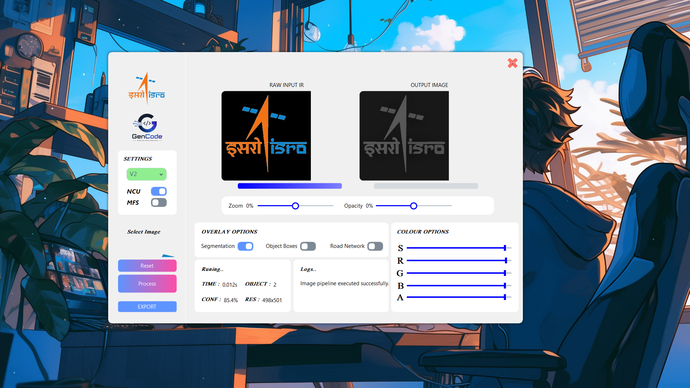
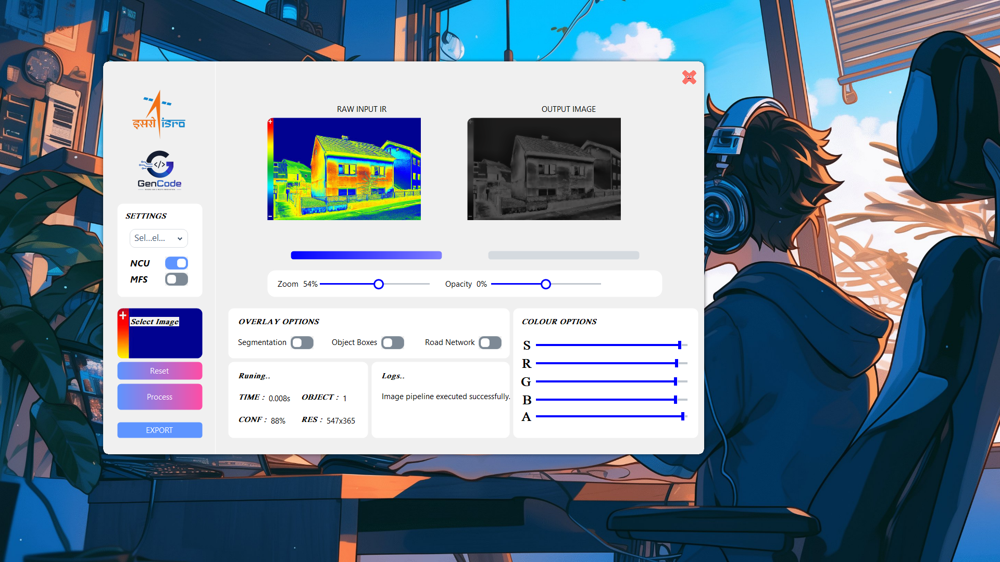
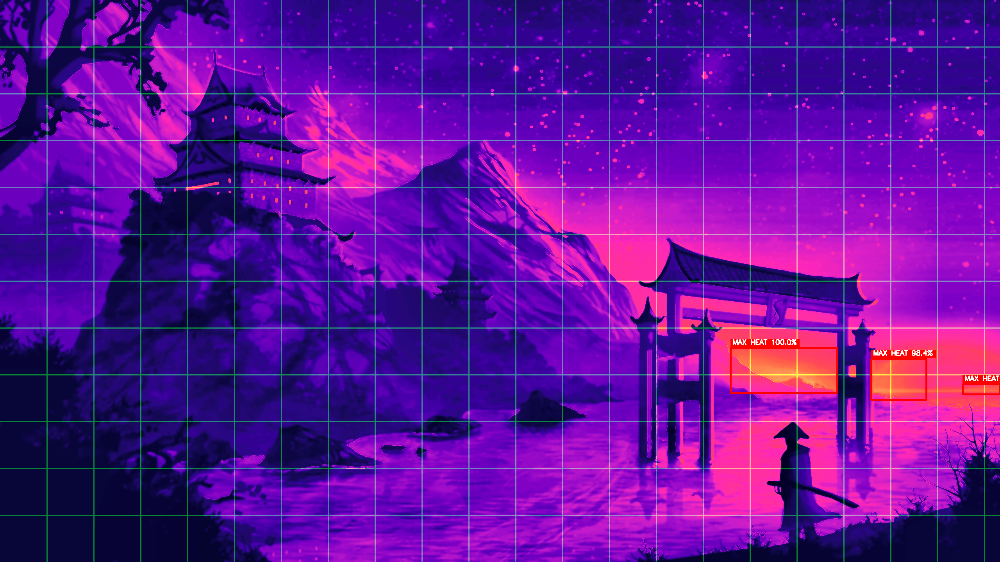
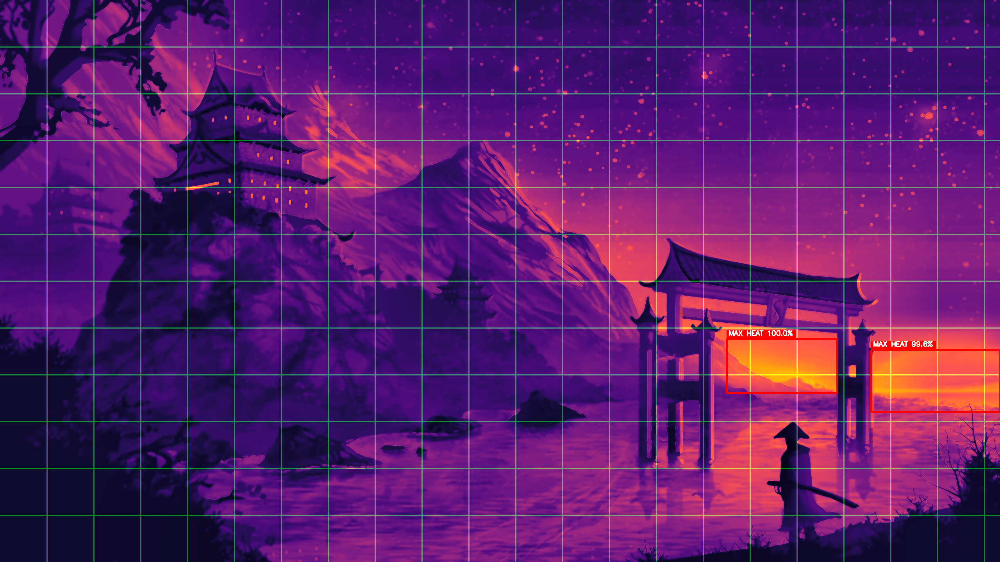

# ISRO-HACKATHON

## Team: GenCode

## Team Members

| Name            | Hack2Skill Profile                                                                 | Role               |
|-----------------|-----------------------------------------------------------------------------------|--------------------|
| Sachin Patel    | [hack2skill.com/dashboard/user_public_profile/?userId=6a2f027622be8b44e661ab79](https://hack2skill.com/dashboard/user_public_profile/?userId=6a2f027622be8b44e661ab79&utm_source=hack2skill&utm_medium=homepage) | Developer          |
| Navneet Raj     | —                                                                                 | Developer          |
| Aniket Nandi    | —                                                                                 | Writer             |
| Shivam Jha      | —                                                                                 | Developer          |

> The ISRO-HACKATHON project is submitted to **Bharatiya Antariksh Hackathon (BAH) 2026** — the third edition of ISRO's national-level space-tech innovation challenge organized in collaboration with Hack2Skill.

## Description

ISRO-HACKATHON is a .NET Windows Forms application for infrared (IR) image processing and analysis, developed as part of the **Bharatiya Antariksh Hackathon (BAH) 2026**. The application leverages OpenCvSharp for image manipulation and Guna UI2 for a modern interface, providing real-time enhancements, segmentation overlays, road network visualization, and simulated object detection on IR imagery. The project addresses BAH 2026 challenge statements including **Infrared Image Colorization and Enhancement** and **Satellite Image Retrieval using Multi-Sensor Data**.

## Project Structure

```
ISRO-HACKATHON/
├── ISRO-HACKATHON/                  # Main application project
│   ├── Form1.cs                     # Main form and image processing logic
│   ├── Form1.Designer.cs            # UI designer file
│   ├── Form1.resx                   # Form resources
│   ├── Helper.cs                    # Helper utilities
│   ├── ImageProcessor.cs            # Image processing abstractions
│   ├── ObjectDetector.cs            # Object detection abstractions
│   ├── PythonBridge.cs              # Python interop bridge
│   ├── Program.cs                   # Application entry point
│   ├── ISRO-HACKATHON.csproj        # Project file
│   ├── Models/                      # Data models
│   │   ├── DetectionResult.cs       # Detection result model
│   │   ├── ProcessingSettings.cs    # Processing settings model
│   │   └── PythonDetectionResponse.cs # Python API response model
│   ├── Services/                    # Application services
│   │   ├── DetectionService.cs      # Detection orchestration
│   │   ├── ImageService.cs          # Image I/O service
│   │   └── PythonService.cs         # Python process launcher
│   ├── Resources/                   # Embedded image resources
│   ├── Properties/                  # Publish profiles and settings
│   ├── bin/                         # Build output
│   └── obj/                         # Intermediate build objects
├── Python/                          # Python utilities and models
│   ├── detector.py                  # YOLO detection script
│   ├── image_processor.py           # Image processing utilities
│   ├── requirements.txt             # Python dependencies
│   └── models/                      # YOLO model weights
│       ├── v1.pt                    # Model version 1
│       └── v2.pt                    # Model version 2
├── img/                             # Output and asset images
│   ├── logo.png                     # Application logo
│   ├── icon.png                     # Application icon
│   ├── out.png                      # Sample processed output 1
│   ├── out1.png                     # Sample processed output 2
│   ├── new_processed.png            # New processed output 1
│   ├── new_processed1.png           # New processed output 2
│   ├── input/                       # Input image staging
│   ├── output/                      # Exported output staging
│   └── temp/                        # Temporary image staging
├── ISRO-HACKATHON.slnx              # Solution file
└── README.md                        # This file
```

## Hackathon: Bharatiya Antariksh Hackathon (BAH) 2026

This project is submitted as part of the **Bharatiya Antariksh Hackathon (BAH) 2026**, the third edition of ISRO's national-level space-tech innovation challenge organized in collaboration with **Hack2Skill**.

### About BAH 2026

The Bharatiya Antariksh Hackathon invites undergraduate, postgraduate, and PhD students from recognised Indian institutions to solve real-world challenges in space technology, satellite imagery, climate science, AI/ML, and astronomy. Teams of 3–4 members develop innovative solutions and may receive mentorship from ISRO scientists and internship opportunities.

### Key Dates

| Event                          | Date                |
|--------------------------------|---------------------|
| Registration & Idea Submission | 10 June – 1 July 2026 |
| Problem Statement Explainer    | 15–16 June 2026     |
| Finalist Announcement          | 20 July 2026        |
| Induction Session              | 21 July 2026        |
| Grand Finale                   | 6–7 August 2026     |

### Challenge Addressed

This project addresses the following BAH 2026 problem statements:

- **Infrared Image Colorization and Enhancement** — AI/ML-based enhancement of IR satellite imagery
- **Satellite Image Retrieval using Multi-Sensor Data** — Multi-spectral fusion and retrieval systems

### Team Link

- **Sachin Patel's Hack2Skill Profile**: https://hack2skill.com/dashboard/user_public_profile/?userId=6a2f027622be8b44e661ab79

### Rewards & Benefits

- Mentorship from ISRO scientists and domain experts
- National-level recognition
- Potential internship opportunities with ISRO
- Travel reimbursement (II AC train fare) for finalists attending the Grand Finale

## Architecture

### Core Features

- **Image Loading** — Open satellite IR images (JPG, PNG, TIFF, BMP)
- **IR Enhancement** — CLAHE, bilateral filtering, Canny edge fusion, gamma correction
- **NUC (Non-Uniformity Correction)** — Statistical normalization for sensor noise reduction
- **Multi-Spectral Fusion** — HSV-based color fusion simulating multi-sensor data
- **Segmentation Overlay** — Otsu thresholding with Bone colormap blending
- **Heat Detection** — Percentile-based hot-region detection with bounding boxes
- **AI Object Detection** — YOLO-based detection via Python bridge (V1/V2 models)
- **Road Network Overlay** — Configurable grid overlay with adjustable opacity
- **Export** — Save processed images as PNG, JPEG, or BMP

### Data Flow

1. User loads an IR image via the file picker
2. The image is processed through the enhancement pipeline (NUC → CLAHE → bilateral filter → edge fusion)
3. Optional segmentation, heat detection, and AI detection overlays are applied
4. The final image is displayed with zoom support and exported on demand

### Models

| File | Purpose |
|------|---------|
| `DetectionResult.cs` | Bounding box and confidence for a detected object or heat region |
| `ProcessingSettings.cs` | Runtime toggle settings (NUC, fusion, RGB adjust, false color) |
| `PythonDetectionResponse.cs` | Deserialized JSON response from the Python detector |

### Services

| File | Purpose |
|------|---------|
| `PythonService.cs` | Spawns the Python detector process, captures stdout/stderr |
| `DetectionService.cs` | Orchestrates heat and AI detection workflows |
| `ImageService.cs` | Handles image I/O and format conversion |

## Python Utilities

The `Python/` folder contains the YOLO-based detection pipeline and image processing utilities:

- `detector.py` — Loads an image, runs YOLO inference with the selected model version, and outputs JSON detections.
- `image_processor.py` — Additional image processing utilities.
- `requirements.txt` — Python dependencies: `ultralytics>=8.3`, `opencv-python`, `numpy`, `Pillow`.
- `models/v1.pt` and `models/v2.pt` — YOLO model weights for version 1 and version 2.

### Python Setup

```bash
cd Python
python -m venv .venv
.venv\Scripts\activate
pip install -r requirements.txt
```

### Running the Detector

```bash
python detector.py --image <path-to-image> --model V1
```

## Technologies

- **C#** / **.NET 8.0**
- **Windows Forms**
- **Guna UI2** v2.0.4.8
- **OpenCvSharp** v4.13.0
- **Python** (YOLO / Ultralytics)

## Setup & Build

### Prerequisites

- [.NET SDK 8.0](https://dotnet.microsoft.com/download) or later
- Windows OS (Windows Forms target)
- Python 3.8+ (for AI detection features)

### Clone and Build

```bash
git clone <repository-url>
cd ISRO-HACKATHON
dotnet restore
dotnet build ISRO-HACKATHON/ISRO-HACKATHON.csproj
```

### Run

```bash
dotnet run --project ISRO-HACKATHON/ISRO-HACKATHON.csproj
```

### Publish (ClickOnce)

```powershell
cd ISRO-HACKATHON
dotnet publish -c Release -p:PublishProfile=ClickOnceProfile
```

The published output is located at `ISRO-HACKATHON/bin/Release/net8.0-windows/app.publish/`.

## Output Images

The `img/` folder contains the following screenshots and assets:

| File                  | Description                          |
|-----------------------|--------------------------------------|
| `logo.png`            | Application logo                     |
| `icon.png`            | Application icon                     |
| `out.png`             | Sample processed output 1            |
| `out1.png`            | Sample processed output 2            |
| `new_processed.png`   | New processed output 1               |
| `new_processed1.png`  | New processed output 2               |
| `input/`              | Staging folder for input images      |
| `output/`             | Staging folder for exported images   |
| `temp/`               | Temporary image cache                |

### Output Previews

#### Output 1


#### Output 2


#### New Processed 1


#### New Processed 2


## License

© GenCode Team
